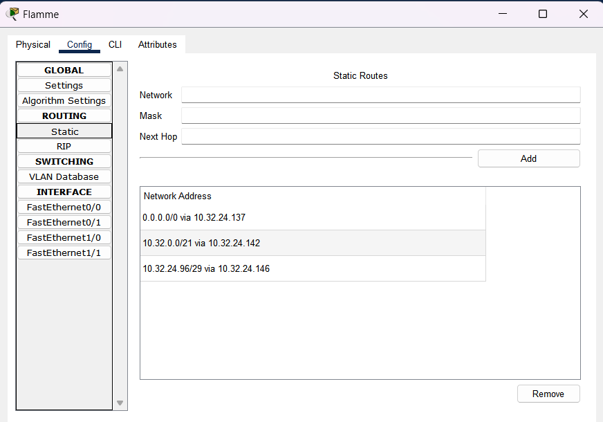

# Jarkom-Modul-4-D21-2023

## Kelompok D21
Akbar Putra Asenti P. 5025211004

Farrela Ranku Mahhisa 5025211129

## Pembagian IP
Kami mengggunakan VLSM pada CPT dan CIDR pada GNS3


Berikut ini adalah pembagian subnet beserta totalnya


## VLSM

Untuk VLSM karena jumlah total IP yang dibutuhkan sebesar 4255, maka dibutuhkan network dengan netmask dengan length sebesar /19 yang memiliki ukuran maksimal usable IP 8190.


Pembagian IP yang dilakukan dimulai menggunakan  VLSM dilakukan dengan cara berikut ini


Kita dapatkan pembagian Network ID sebagai berikut


| Nama Subnet | Network ID  |
|  :---:      |     :---:   |
| A1          | 10.32.24.112|
| A2          | 10.32.24.64 |
| A3          | 10.32.24.136|
| A4          | 10.32.24.140|
| A5          | 10.32.0.0   |
| A6          | 10.32.12.0  |
| A7          | 10.32.24.144|
| A8          | 10.32.24.96 |
| A9          | 10.32.24.148|
| A10         | 10.32.24.104|
| A11         | 10.32.24.116|
| A12         | 10.32.20.0  |
| A13         | 10.32.24.120|
| A14         | 10.32.24.0  |
| A15         | 10.32.16.0  |
| A16         | 10.32.24.124|
| A17         | 10.32.23.0  |
| A18         | 10.32.24.128|
| A19         | 10.32.24.132|
| A20         | 10.32.8.0   |
| A21         | 10.32.22.0  |


Selanjutnya, kita bagi IP per subnet, berikut adalah hasilnnya


Setelah membagikan sesuai dengan subnet, kita assign masing-masing IP ke masing-masing node, pembagiannya adalah sebagai berikut


Dalam langkah selanjutnya, network VLSM ini akan dibuat di **Cisco Packet Tracer**.

### Cisco Packet Tracer (VLSM)

Berikut adalah hasil topologi network yang dibuat di Cisco Packet Tracer.


Langkah selanjutnya adalah konfigurasi IP untuk setiap node di topologi, sesuai dengan pembagian IP yang telah dilakukan sebelumnya. Proses ini disebut dengan **Subnetting**

Konfigurasi IP dapat dilakukan dengan membuka salah satu node kemudian masuk ke dalam menu **INTERFACE**, kemudian melakukan memasukkan IP address, Subnet Mask, dan menyalakan port dengan mencentang tombol **Port Status**.

Konfigurasi IP setiap router perlu memperhatikan interface eth yang dipakai di subnet yang mana, sebagai contoh berikut adalah salah satu contoh konfigurasi IP di router Fern pada Fa (FastEthernet) 0/0.


Fa 0/0 pada Fern perlu disetup sedemikian karena interface ini mengarah ke node Flamme, sehingga dapat membentuk salah satu subnet yang telah ditentukan sebelumnya, yaitu subnet A4.

Untuk node yang merupakan host atau server, perlu ditambahkan default gateway yang mengarah ke interface router yang mengarah ke arah host atau server tersebut. Default gateway dapat ditentukan pada menu **Setting** pada host atau server.

Sebagai contoh, di node LaubHills (397 Hosts), default gateway yang digunakan adalah interface pada Fern Fa 0/1 yang mengarah ke LaubHills. 

### Di LaubHills


### Di Fern


### Routing

Proses selanjutnya adalah routing, tujuan dari proses ini adalah untuk "mengenalkan" suatu router dengan subnet-subnet yang terhubung dengan router tetangganya. 

Routing dapat dilakukan dengan cara menambahkan network ID, netmask, dan next hop untuk suatu subnet di dalam menu **Routing > Static**.

Untuk sebuah router yang memiliki host atau server, perlu ditambahkan routing dengan network ID 0.0.0.0 netmask 0.0.0.0 dengan next hop mengarah ke router utama (Aura).

Sebagai contoh, berikut adalah routing yang dilakukan pada router Fern:


Setelah setup router Fern, perlu dilakukan setup pada router selanjutnya yang berhubungan dengan Fern, yaitu Flamme. Pada Flamme, setup routing adalah sebagai berikut:



Pada Flamme, terdapat tiga buah routing yang dilakukan, 0.0.0.0 karena Flamme memiliki host berupa RohrRoad, 10.32.0.0 yang merupakan subnet LaubHills-AppetitRegion-Fern, dan 10.32.24.96 yang merupakan subnet Himmel-SchwerMountains.


Pada Frieren perlu enam routing, yaitu semua routing pada Flamme, 0.0.0.0 karena Frieren memiliki host (LakeKorridor) ditambah dua subnet baru, yaitu subnet Flamme-Fern dan Flamme-Himmel.

Proses routing ini perlu dilanjutkan hingga router utama (Aura) dan perlu dijalankan untuk setiap cabang pada network. Sehingga di Aura terdapat routing untuk setiap subnet kecuali subnet yang bersebelahan dengan Aura (1 Hop), total terdapat 18 subnet yang perlu disimpan di Aura.


Untuk next hop perlu disesuaikan dengan topologi, dalam contoh diatas next hop 10.32.24.114 di Aura mengarah ke Frieren (arah kiri), next hop 10.32.24.126 di Aura mengarah ke Denken (arah kanan), dan next hop 10.32.24.150 di Aura mengarah ke Eisen (arah bawah).

### Testing VLSM

Setelah subnetting dan routing dijalankan, dapat dilakukan testing di Cisco Packet Tracer dengan menggunakan tool PDU (Keybind P) untuk mengirim pesan dari satu node ke node yang lain.


Pengetesan yang dilakukan:

-	Sein –> Richter (Success)
-	GranzChannel –> Turk Region (Success)
-	RiegelCanyon –> Aura (Success)
-	Fern –> Linie (Success)
-	RoyalCapital –> LaubHills (Success)
-	Heiter –> Denken (Success)
-	SchwerMountains –> Lugner (Success)

## CIDR

Dalam CIDR langkah yang pertama dilakukan adalah melakukan penggabungan subnet. Penggabungan subnet yang kami lakukan adalah sebagai berikut:


Dengan rincian sebagai berikut:

### Penggabungan pertama: B


### Penggabungan kedua: C


### Penggabungan ketiga: D


### Penggabungan keempat: E


### Penggabungan kelima: F


### Penggabungan keenam: G


Maka akan dihasilkan subnet G1 yang berisi semua subnet A. Selanjutnya perlu dilakukan pembagian Network ID CIDR dengan menggambar tree berdasarkan penggabungan yang tadi dilakukan, sehingga dihasilkan hasil sebagai berikut:


Kemudian didapatkan pembagian network ID sebagai berikut:


Dari network ID tersebut dapat dilakukan pembagian IP kepada setiap node pada subnet, sebagai berikut:


| Nama Subnet | Network ID   |
|  :---:      |     :---:    |
| A1          | 10.32.144.32 |
| A2          | 10.32.144.0  |
| A3          | 10.32.164.0  |
| A4          | 10.32.136.0  |
| A5          | 10.32.128.0  |
| A6          | 10.32.160.0  |
| A7          | 10.32.168.8  |
| A8          | 10.32.168.0  |
| A9          | 10.32.32.0   |
| A10         | 10.32.84.0   |
| A11         | 10.32.82.0   |
| A12         | 10.32.80.0   |
| A13         | 10.32.72.0   |
| A14         | 10.32.68.0   |
| A15         | 10.32.64.0   |
| A16         | 10.32.193.0  |
| A17         | 10.32.192.0  |
| A18         | 10.32.16.0   |
| A19         | 10.32.8.0    |
| A20         | 10.32.0.0    |
| A21         | 10.32.4.0    |

Selanjutnya hal yang perlu dilakukan adalah membuat network ini ke dalam tool GNS3.

### GNS3 (CIDR)

Berikut adalah struktur topologi yang dibuat pada GNS3.


Proses yang perlu dilakukan selanjutnya adalah subnetting. 

Prosesnya sama dengan proses subnetting di Cisco Packet Tracer, perlu memberikan informasi berupa alamat IP, subnet mask, dan default gateway untuk node berupa host atau server.

Subnetting dalam GNS3 dapat dilakukan dengan **klik kanan suatu node > configuration > Edit network configuration**. 

Sebagai contoh berikut adalah konfigurasi subnetting pada router Aura:

```
auto eth0
iface eth0 inet dhcp

auto eth1
iface eth1 inet static
	address 10.32.144.33
	netmask 255.255.255.252

auto eth2
iface eth2 inet static
	address 10.32.32.1
	netmask 255.255.255.252

auto eth3
iface eth3 inet static
	address 10.32.193.1
	netmask 255.255.255.252
```

Untuk router Aura, interface eth0 mengarah ke NAT1 yang menggunakan dhcp, kemudian untuk eth1 mengarah ke subnet Frieren-Aura dimana IP Aura bernilai 10.32.144.33, eth2 mengarah ke subnet Aura-Eisen dimana IP Aura bernilai 10.32.32.1, dan eth3 mengarah ke subnet Aura-Denken dimana IP Aura bernilai 10.32.193.1.

Sedangkan berikut adalah contoh subnetting untuk node yang berupa server (Stark):

```
auto eth0
iface eth0 inet static
	address 10.32.16.2
	netmask 255.255.255.252
	gateway 10.32.16.1
```

Karena Stark merupakan host server, perlu ditambahkan default gateway, dalam contoh ini default gateway dari Stark mengarah ke subnet Eisen-Stark, yaitu eth4 dari Eisen yang bernilai 10.32.16.1.

Setelah subnetting dilakukan, langkah selanjutnya adalah routing. Pada GNS3, routing dilakukan dengan menjalankan command pada command line berupa.

```
route add -net <NID subnet> netmask <netmask> gw <IP gateway>
```

Proses ini sama dengan proses routing di Cisco Packet Tracer. Pada suatu router akan "dikenalkan" subnet-subnet yang terhubung dengan router tetangganya.

Untuk menghindari menjalankan script berulang-ulang, setting routing dapat disimpan di direktori ~/.bashrc

Berikut adalah contoh routing di router Lugner:


Gateway disini memiliki tugas yang sama dengan next hop pada Cisco Packet Tracer, disini gateway pada Lugner mengarah ke eth3 pada Eisen. Contoh selanjutnya adalah routing pada Eisen:


Dapat dilihat pada Eisen terdapat tujuh buah routing, 0.0.0.0 mengarah ke Aura, 4 selanjutnya mengarah ke arah bawah Eisen (RiegelCanyon, BredtRegion, GranzChannel, Lawine-Linie), dan 2 routing terakhir mengarah ke arah kanan Eisen (TurkRegion dan GrobeForest).

Setelah proses subnetting dan routing, langkah selanjutnya adalah Testing:

### Testing CIDR

Testing pada GNS3 dilakukan dengan cara membuka CLI salah satu node dan melakukan ping menuju node salah satu IP milik node lain. Apabila terdapat balasan dari ip tersebut maka subnetting dan routing telah berhasil untuk menghubungkan antar subnet.

```
ping <ip node lain> -c 5
```

### Test #1: Sein -> Richter (Success)


### Test #2: GranzChannel -> TurkRegion (Success)


### Test #3: RiegelCanyon -> Aura (Success)


### Test #4: Fern -> Linie (Success)


### Test #5: RoyalCapital -> LaubHills (Success)


### Test #5: Heiter -> Denken (Success)


### Test #6: SchwerMountains -> Lugner (Success)


